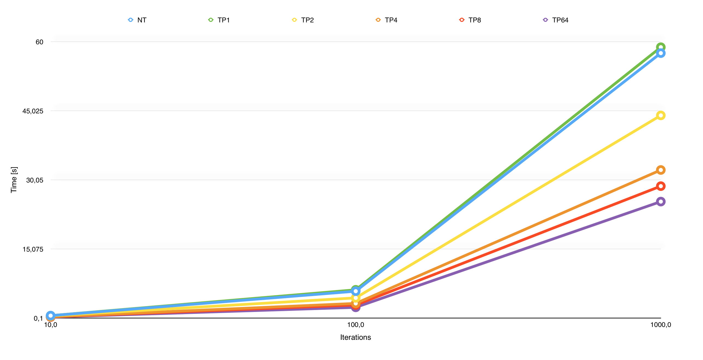

#ThreadPool

A thread safe pool using C++11 features.

Features:

* Task insertion via lambda expressions
* Resize of the pool at runtime
* Support virtually an infinite number of threads in the pool
* Fluent-Interface for task insertion
* Fast
* Dispatch groups methods
* Thread safe [under testing]
* Single header [threadpool.hpp]

The ThreadPool is tested under macOS Sierra 10.12 (Apple LLVM version 7.2.0 (clang-702.0.25)) 
and LinuxMint 17.1 Rebecca (g++ 4.8.2).

## Compile
You can run some example called in the provided main.cpp file
with the following bash lines, or simply include the *threadpool.hpp* file
in your projects.

for macOS (and OSX as well):
```bash
g++ -std=c++11 -O3 main.cpp
```

for Linux:
```bash
g++ -std=c++11 -O3 -pthread main.cpp
```

The -O3 optimization parameter is obviously optional.

## Usage example 
```C++
using namespace astp;
/**
*	Create a pool with the default 
*	architecture dependent number
* 	of threads.
*/
ThreadPool tp = ThreadPool(); 
for (int i = 0; i < 100; i++) {
	/**
	*	Push load in the pool queue 
	*	via lambda.
	*/
    tp.push([]() {
        std::vector<int> vec;
        for (int k = 0; k < 1000; k++) {
            vec.push_back(k);
            std::cout << vec.size() << std::endl;
        }
    });
}
/**
*	Wait until all jobs are done.
*	Not mandatory, is up to you.
*/
tp.wait();
```
## API

### Initialization
You can create the thread pool with the default platform dependent number of threads, or
you can specify your desired number: at least one thread is created.
```C++
auto tp = astp::ThreadPool();   // -> Create default pool
auto tp = astp::ThreadPool(64); // -> Create 64 threads
auto tp = astp::ThreadPool(0);  // -> Create one thread
auto tp = astp::ThreadPool(-1); // -> Create one thread
```
### Resize
The pool can be resized after it was created: if the resizing operation decrease
the current number of threads, a number equal to the difference is popped from 
the pool, but only when the threads have finished to compute their workload.
At least one thread is keep in the pool.
During the resizing, the stop of the pool is blocked.
```C++
// For instace, current pool size is 64.
tp.resize(31) // -> Pop  (64 - 31) = 33 threads
// For instace, current pool size is 64.
tp.resize(74) // -> Push (74 - 64) = 10 threads
tp.resize(0)  // -> Resize to one thread
tp.resize(-1) // -> Resize to one thread
```

### Insertion of tasks
There are three basic syntax for task insertion in the pool, all of them
uses lambda expression. The task inserted are appended at the end of a queue.
```C++
// Classic syntax
tp.push([ /* Lambda capturing */ ] () { /* Task */ });

// Variadic template syntax
tp.push(
[ /* Lambda capturing */ ] () { /* Task1 */ },
[ /* Lambda capturing */ ] () { /* Task2 */ },
[ /* Lambda capturing */ ] () { /* Task3 */ }
);

// Overload operator << syntax
tp << []() { /* Some jobs */};
```
All these syntax have a fluent-interface, so you can chain the calls:

```C++
tp.push([](){}).push([](){}).push([](){});
tp << []() { /* Some jobs1 */} << []() { /* Some jobs2 */};
```
When you push a task, the task is inserted in queue, and it will be
executed when it will be at the front of the queue. 
See the next section for how to wait the execution of the task.

### Waiting execution
When the task are inserted in the pool, you cannot know when
they will be completed. If you need to know when they are completed,
you can wait the execution of all the tasks with the following method.
This will wait, blocking the caller thread, until all the tasks have finished
to run.
```C++
tp.wait();
```

### Stop the pool
With this method all the threads in the pool will be 
stopped, waiting the end of task execution, and then will
be popped. So at end of the stop exceution, the thread pool
will have zero threads. During the stop, the resize of the pool
is blocked.
```C++
tp.stop();
```

### Dispatch Groups
You may have the need of track a series of jobs, so
the thread pool has some methods to accomplish that.
Dispatch group introduce a little overhead, so you should
use it only when you really need to track some tasks.
Start using them by creating a group with a string id,
then append some tasks, and signal the end of the insertion.
When you signal the end of insertion, tasks will be moved
to the pool queue. Than you can wait until they are computed.
```C++
// Create a group named "group_id"
tp.dispatch_group_enter("group_id");
// Insert tasks in the group.
tp.dispatch_group_insert("group_id", []() { /* task1 */ });
tp.dispatch_group_insert("group_id", []() { /* task2 */ });
// Singnal the end of task insertion.
tp.dispatch_group_leave("group_id");  
// Wait the end of execution [if needed]
tp.dispatch_group_wait("group_id");
// Wait the end of execution [if needed], 
// and fire a callback when all tasks in the group were ran.
tp.dispatch_group_wait("group_id", []() { /* Fired when the group has been entirely computed */ });
// Synchronize access to external container
tp.dispatch_group_synchronize("group_id");
tp.dispatch_group_end_synchronize("group_id");
```
Dispatch group allow the execution of a task with high priority:
the method *dispatch_group_now* will insert the task directly
at the front of the pool queue.
```C++
tp.dispatch_group_now("group_id", []() { std::cout << "High priority" << std::endl; });
```
This is useful when you have a lot of tasks in the pool queue and you want
to process something without waiting the end of all others tasks. 

### Synchronization
Thread pool has four methods that allow the synchronization of the threads in the pool
when accessing some external critical part. These methods acts with binary semaphore
implemented in a nested class of the thread pool.

Standard synchronization:
```C++
std::vector<int> data;
for (int i = 0; i < 100; i++) {
    tp.push([i, &tp, &data](){
        // Signal to all others threads in the pool
        // to wait.
        tp.synchronize(); 
        // Safely modify external container.
        data.push_back(i);
        // Signal all others thread to go on.
        tp.end_synchronize();
    }); 
}
```

Dispatch group synchronization:
```C++
std::vector<int> data;
tp.dispatch_group_enter("data_group");
for (int i = 0; i < 100; i++) {
    tp.dispatch_group_insert("data_group", [i, &tp, &data](){
        // Signal to all others threads that 
        // are working for the group to wait.
        tp.dispatch_group_synchronize("data_group"); 
        // Safely modify external container.
        data.push_back(i);
        // Signal all others threads in the group to go on.
        tp.dispatch_group_synchronize("data_group");
    }); 
}
tp.dispatch_group_leave("data_group");  
```

### Sleep
Every thread in the pool is running in a while loop (until you stop the pool).
This is a consuming process, so you can set the sleep time for threads
when there aren't jobs to do, so the threads in the pool will go to sleep.
An higher value of sleep makes the pool less responsive when new jobs are
inserted, so in case of performance critical tasks, you should set this
interval small.
```C++
// Set sleep in nanoseconds
tp.set_sleep_time_ns(100);
// Set sleep in milliseconds
tp.set_sleep_time_ms(100);
// Set sleep in seconds
tp.set_sleep_time_s(100);
tp.set_sleep_time_s(99.85);
// Return the current sleep time in nanoseconds
auto stns = tp.sleep_time_ns(); 
```

### Misc
Varius methods in order to get information
about the state of the threadpool.
```C++
auto current_pool_size = tp.pool_size();
auto current_queue_size = tp.queue_size(); 
auto is_empty = tp.queue_is_empty();
```


## Performance
This test was a write to text test: write one million of lines
in a *iterations* number of different text files.
NT means the sequential version, TP[num] means the number of
threads in the threadpool.




Test function:
```C++
void
write(int i) {
    std::ofstream myfile;
    myfile.open ("example" + std::to_string(i) + (".txt"));
    for(int k = 0; k < 1000000; k++) 
        myfile << "Writing this to a file.\n";
    myfile.close();
}
```

## To Do
I'm working on the exception handling.